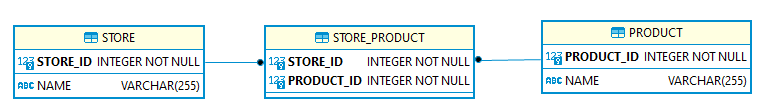
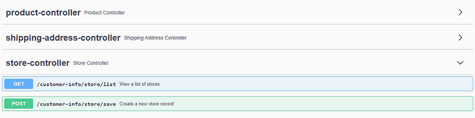

## spring-boot-hibernate-unidirectional-many-to-many-join-table-relationship-mapping

1- Implement hibernate unidirectional many-to-many join-table relational mapping  
2- ER diagram :   
NOT : Many Product related to many Store  

  

3- Start Spring Boot application with a specific profile such as "-Dspring.profiles.active=dev" .  
4- swagger-ui can be accessed from URL : http://localhost:8080/customer-info/swagger-ui/   

  
 

### Tech Stack
Java 11  
H2 Database Engine  
spring boot  
spring data jpa  
spring web  
hibernate  
logback  
maven  
junit  
springfox-swagger-ui  
datasource-proxy  
 

## API OPERATIONS
### Save store with products sucessfully to database

Method : HTTP.POST  
URL : http://localhost:8080/customer-info/store/save  

Request : 
<pre>
curl --location --request POST 'http://localhost:8080/customer-info/store/save' \
--header 'Content-Type: application/json' \
--data-raw '{
  "name": "jeans_store",
  "products": [
    {
      "name": "prod1"
    },
    {
      "name": "prod2"
    },
    {
      "name": "prod3"
    }
  ]
}'
</pre> 

Response : 

HTTP response code 200  
<pre>
{
    "id": 1,
    "name": "jeans_store",
    "products": [
        {
            "id": 1,
            "name": "prod3"
        },
        {
            "id": 2,
            "name": "prod1"
        },
        {
            "id": 3,
            "name": "prod2"
        }
    ]
}
</pre>

### List Store saved to database

Method : HTTP.GET  
URL : http://localhost:8080/customer-info/store/list  

Request : 
<pre>
curl --location --request GET 'http://localhost:8080/customer-info/store/list'
</pre> 

Response : 

HTTP response code 200  
<pre>
[
    {
        "id": 1,
        "name": "jeans_store",
        "products": [
            {
                "id": 1,
                "name": "prod3"
            },
            {
                "id": 2,
                "name": "prod1"
            },
            {
                "id": 3,
                "name": "prod2"
            }
        ]
    }
]
</pre> 
